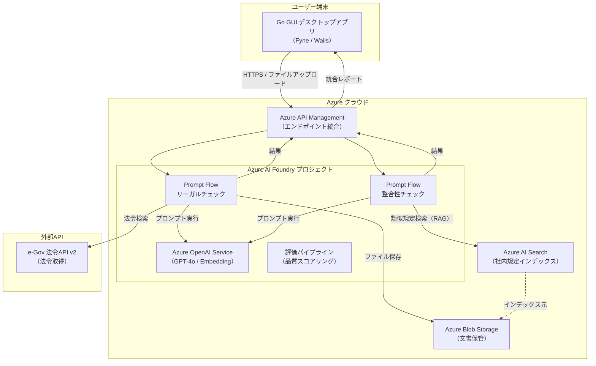
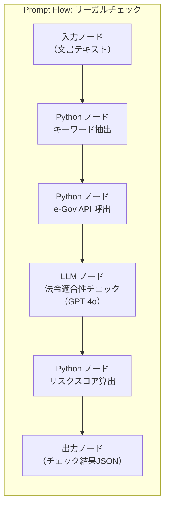
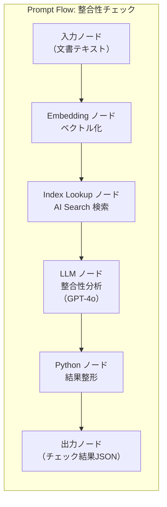
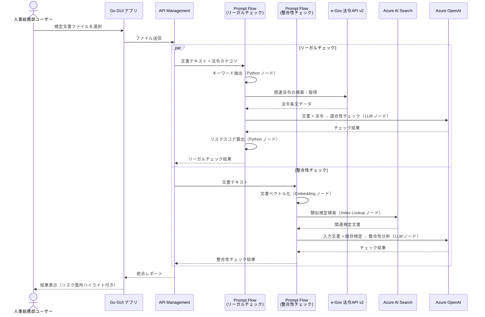
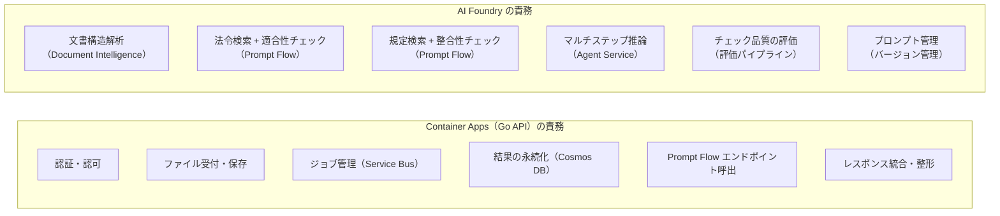
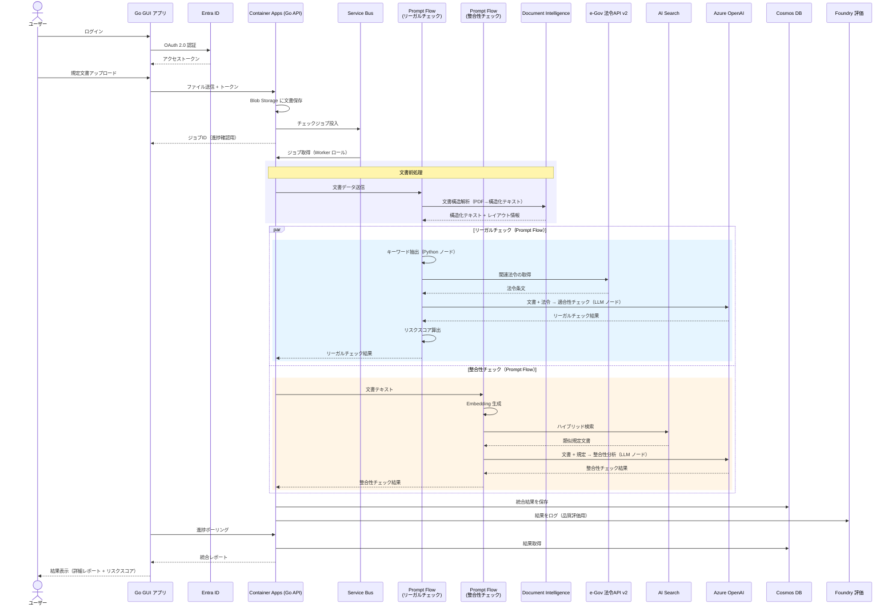
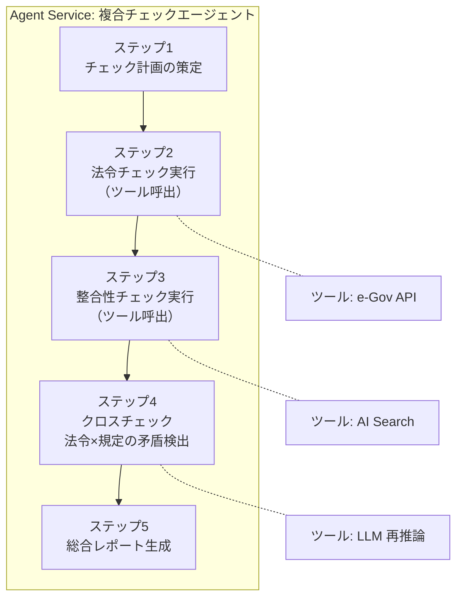
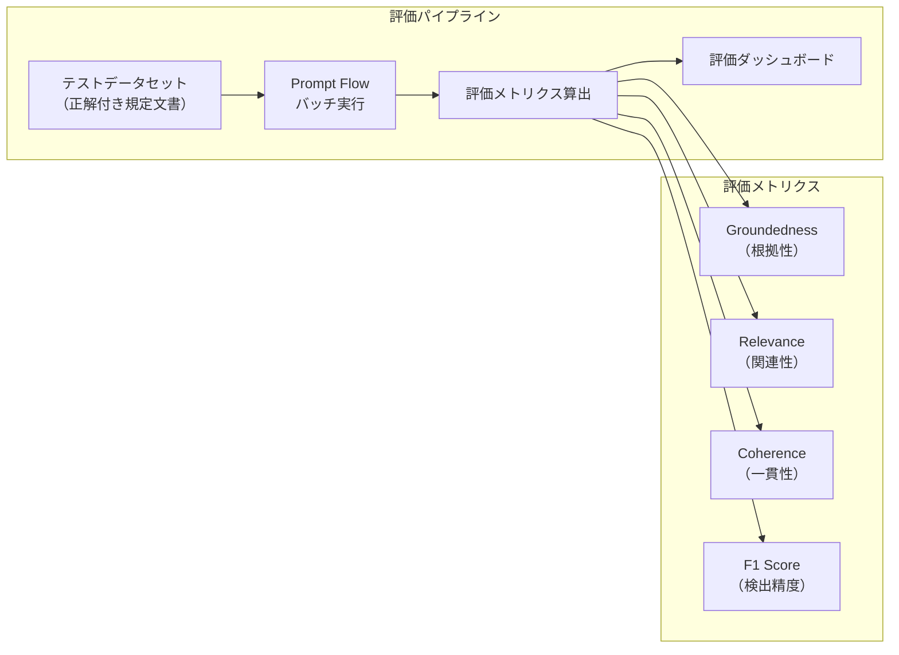
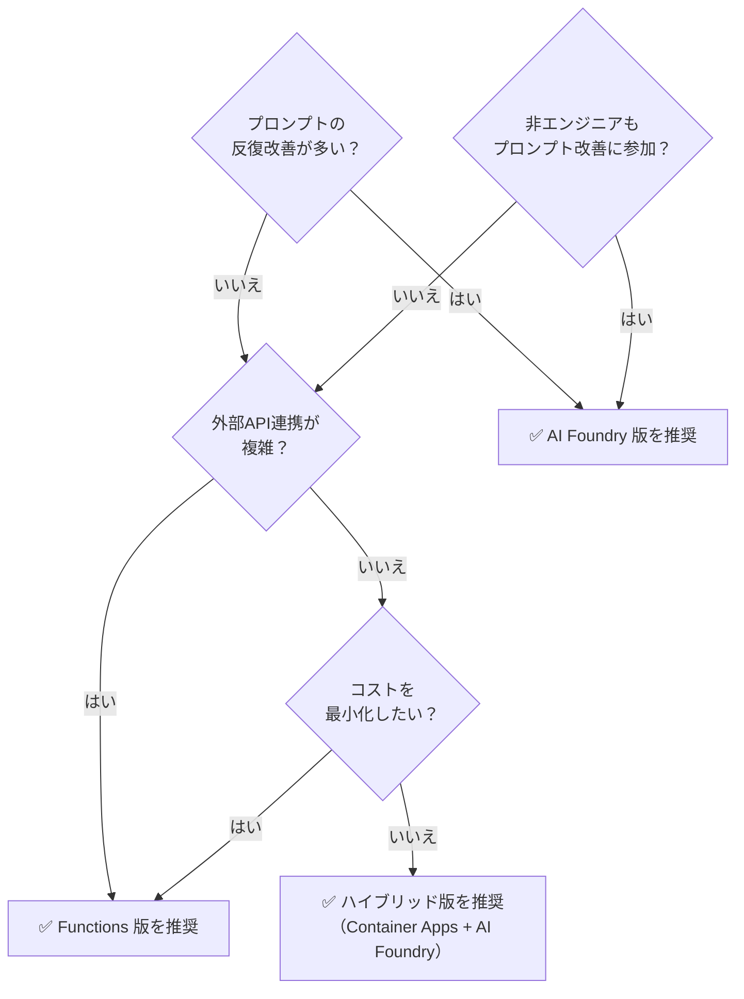
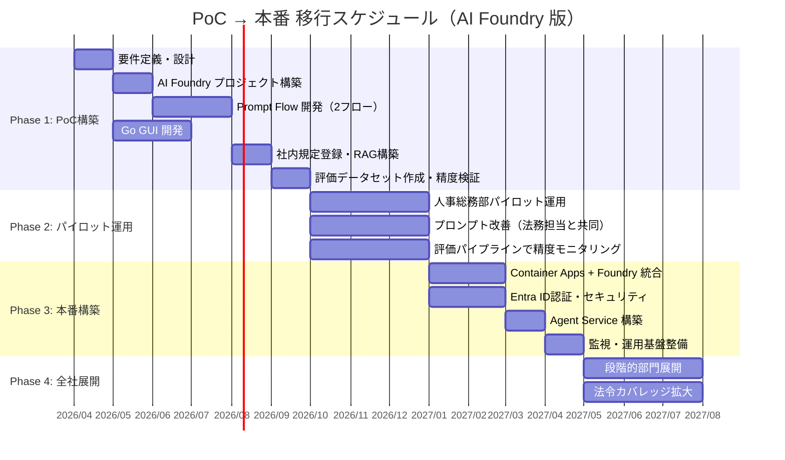

# 規定チェックシステム アーキテクチャ設計書（Azure AI Foundry 版）

> 本書は [Functions版アーキテクチャ](./規定チェックシステム_アーキテクチャ設計書.md) の **代替パターン** として、  
> **Azure AI Foundry** を中核に据えた構成を提案するものです。

---

## 1. Azure AI Foundry とは

Azure AI Foundry（旧 Azure AI Studio）は、AI アプリケーションの **開発・評価・運用を一元管理** するプラットフォーム。

```
┌─────────────────────────────────────────────────────────┐
│                  Azure AI Foundry                        │
│                                                         │
│  ┌─────────────┐  ┌──────────────┐  ┌───────────────┐  │
│  │ モデルカタログ │  │ Prompt Flow  │  │  評価・監視    │  │
│  │ GPT-4o      │  │ (AIパイプ    │  │ (品質メトリ   │  │
│  │ Embedding   │  │  ライン)     │  │  クス)        │  │
│  └─────────────┘  └──────────────┘  └───────────────┘  │
│                                                         │
│  ┌─────────────┐  ┌──────────────┐  ┌───────────────┐  │
│  │ Agent Service│  │ 接続管理     │  │ コンテンツ    │  │
│  │ (AIエージェ │  │ (AI Search,  │  │ フィルター    │  │
│  │  ント構築)  │  │  Blob等)     │  │ (安全性)     │  │
│  └─────────────┘  └──────────────┘  └───────────────┘  │
└─────────────────────────────────────────────────────────┘
```

### Functions 版との根本的な違い

| 観点 | Functions 版 | AI Foundry 版 |
|------|-------------|--------------|
| AI パイプラインの構築 | コードで全ロジックを実装 | **Prompt Flow** でビジュアル / YAML 定義 |
| プロンプト管理 | コード内にハードコード or 設定ファイル | **Foundry 上で一元管理・バージョン管理** |
| RAG 構築 | 自前でインデックス作成コードを実装 | **接続設定のみ**で AI Search と統合 |
| 評価・品質管理 | 自前テストスクリプト | **組込み評価ツール**（正確性・根拠性・関連性） |
| モデル切替 | コード変更 + 再デプロイ | **Foundry UI 上で即時切替** |
| 運用監視 | Application Insights を個別設定 | **Foundry ダッシュボード**で AI 固有メトリクス |

---

## 2. PoC（パイロット版）アーキテクチャ — AI Foundry 版

> **設計方針**: AI Foundry の Prompt Flow でチェックパイプラインを構築。コード量を最小化し、プロンプトの反復改善に集中する。

### 2.1 構成図



### 2.2 Prompt Flow パイプライン設計

リーガルチェックと整合性チェックそれぞれを **Prompt Flow** として定義します。

#### リーガルチェック フロー



```yaml
# legal_check_flow.yaml（概念）
inputs:
  document_text:
    type: string
    description: チェック対象の規定文書テキスト
  law_categories:
    type: list
    description: 対象法令カテゴリ

nodes:
  - name: extract_keywords
    type: python
    source: extract_keywords.py
    inputs:
      text: ${inputs.document_text}

  - name: fetch_laws
    type: python
    source: fetch_laws_egov.py
    inputs:
      keywords: ${extract_keywords.output}
      categories: ${inputs.law_categories}

  - name: legal_check
    type: llm
    source: legal_check_prompt.jinja2
    inputs:
      model: gpt-4o
      document: ${inputs.document_text}
      laws: ${fetch_laws.output}

  - name: calculate_risk
    type: python
    source: calculate_risk_score.py
    inputs:
      check_result: ${legal_check.output}

outputs:
  result:
    type: object
    value: ${calculate_risk.output}
```

#### 整合性チェック フロー



### 2.3 処理フロー



### 2.4 PoC 技術スタック

| レイヤー | 技術 | 選定理由 |
|---------|------|---------|
| GUI | **Go + Wails** | モダンなWebベースUI |
| API Gateway | **Azure API Management**（Consumption） | Prompt Flow エンドポイントの統合 |
| AI オーケストレーション | **Azure AI Foundry — Prompt Flow** | ノーコード/ローコードでAIパイプライン構築 |
| LLM | **Azure OpenAI Service**（GPT-4o） | Foundry から直接接続 |
| ベクトル検索 | **Azure AI Search** | Foundry の Index Lookup ノードで直接統合 |
| ストレージ | **Azure Blob Storage** | 文書保管・規定原本 |
| 法令取得 | **e-Gov 法令API v2** | Prompt Flow の Python ノードから呼出 |
| AI評価 | **Foundry 組込み評価** | プロンプト品質の自動スコアリング |

### 2.5 AI Foundry 版 PoC の利点

```
✅ AI Foundry 版ならではの利点
  ├── Prompt Flow でチェックロジックをビジュアルに構築・変更
  ├── プロンプトのバージョン管理が Foundry 上で完結
  ├── 組込み評価ツールでチェック精度を定量的に測定
  ├── RAG 構成が Index Lookup ノードで簡単に実現
  ├── モデル変更（GPT-4o → GPT-4.1 等）がUI操作のみ
  └── 非エンジニア（法務担当）もプロンプト改善に参加可能

⚠ 制約・注意点
  ├── Prompt Flow の Python ノード実行環境に制約あり
  ├── e-Gov API 呼出など外部連携はカスタムコードが必要
  ├── 複雑な分岐ロジックは Prompt Flow だけでは限界あり
  └── ランタイム（Managed Online Endpoint）の最低コストが Functions より高い
```

---

## 3. 本番アーキテクチャ — AI Foundry 版

> **設計方針**: AI Foundry を AI オーケストレーション層として中心に配置。外部連携やビジネスロジックは Container Apps が担い、両者のハイブリッドで堅牢なシステムを構築。

### 3.1 構成図

```mermaid
flowchart TB
    subgraph ユーザー端末
        GUI["Go GUI デスクトップアプリ<br/>（Wails + WebView）"]
    end

    subgraph Azure["Azure クラウド"]
        direction TB

        subgraph フロント層
            FD["Azure Front Door<br/>（WAF + CDN）"]
            APIM["Azure API Management<br/>（Standard v2）"]
        end

        subgraph 認証・セキュリティ
            AAD["Microsoft Entra ID<br/>（旧 Azure AD）"]
            KV["Azure Key Vault<br/>（シークレット管理）"]
        end

        subgraph アプリケーション層["アプリケーション層（Go API）"]
            ACA["Azure Container Apps<br/>（メインAPI / Go）"]
            SB["Azure Service Bus<br/>（非同期ジョブキュー）"]
        end

        subgraph AI_Foundry["Azure AI Foundry プロジェクト"]
            PF_LEGAL["Prompt Flow<br/>リーガルチェック<br/>（Managed Endpoint）"]
            PF_CONSIST["Prompt Flow<br/>整合性チェック<br/>（Managed Endpoint）"]
            AGENT["AI Foundry Agent Service<br/>（マルチステップ推論）"]
            AOAI["Azure OpenAI Service<br/>（GPT-4o / Embedding）"]
            DI["Azure AI Document Intelligence<br/>（文書構造解析）"]
            EVAL["評価 & モニタリング<br/>（品質ダッシュボード）"]
        end

        subgraph 検索・データ層
            SEARCH["Azure AI Search<br/>（ハイブリッド検索）"]
            BLOB["Azure Blob Storage<br/>（文書保管）"]
            COSMOS["Azure Cosmos DB<br/>（チェック結果・メタデータ）"]
            SQL["Azure SQL Database<br/>（規定マスタ・ユーザー管理）"]
        end

        subgraph 運用・監視
            MON["Azure Monitor"]
            AI_INSIGHTS["Application Insights"]
        end
    end

    subgraph 外部API
        EGOV["e-Gov 法令API v2"]
    end

    GUI -- "HTTPS + OAuth 2.0" --> FD
    FD --> APIM
    APIM -- "トークン検証" --> AAD
    APIM --> ACA

    ACA -- "文書アップロード" --> BLOB
    ACA -- "非同期ジョブ投入" --> SB
    ACA -- "結果永続化" --> COSMOS
    ACA -- "マスタ参照" --> SQL
    ACA -- "シークレット取得" --> KV

    SB -- "ジョブ取得" --> ACA

    ACA -- "リーガルチェック実行" --> PF_LEGAL
    ACA -- "整合性チェック実行" --> PF_CONSIST
    ACA -- "複合チェック（Agent）" --> AGENT

    PF_LEGAL --> AOAI
    PF_LEGAL --> EGOV
    PF_LEGAL --> DI

    PF_CONSIST --> AOAI
    PF_CONSIST --> SEARCH

    AGENT --> AOAI
    AGENT --> SEARCH
    AGENT --> EGOV

    SEARCH -. "インデックス元" .-> BLOB

    ACA --> AI_INSIGHTS
    AI_Foundry -. "AIメトリクス" .-> EVAL
    AI_INSIGHTS --> MON
```

### 3.2 レイヤー別の役割分担



### 3.3 処理フロー（本番）



### 3.4 Agent Service の活用（本番拡張）

本番フェーズでは、AI Foundry **Agent Service** を活用し、単純なチェックでは判断が難しい **複合的な問題** をマルチステップで推論します。



**Agent Service の利用シーン**:

| シーン | 説明 |
|-------|------|
| 法令改正の影響分析 | 改正法令に対し、影響を受ける社内規定を自律的に洗い出し |
| 複数規定の一括チェック | 関連する複数規定をまとめてチェックし、相互矛盾を検出 |
| 改善案の自動生成 | リスク箇所に対して修正案を複数パターン提示 |

---

## 4. 本番 技術スタック

| レイヤー | 技術 | 選定理由 |
|---------|------|---------|
| GUI | **Go + Wails v2** | WebViewベースでリッチUI |
| API Gateway | **Azure Front Door + API Management** | WAF・レート制限 |
| 認証 | **Microsoft Entra ID** | SSO・RBAC |
| メインAPI | **Azure Container Apps**（Go） | ジョブ管理・結果統合・外部連携 |
| 非同期キュー | **Azure Service Bus** | 大容量文書の非同期処理 |
| **AI オーケストレーション** | **Azure AI Foundry — Prompt Flow** | **チェックパイプラインをビジュアル管理** |
| **マルチステップ推論** | **Azure AI Foundry — Agent Service** | **複合チェック・改善案生成** |
| 文書解析 | **Azure AI Document Intelligence** | Foundry 接続経由で利用 |
| LLM | **Azure OpenAI Service**（GPT-4o） | Foundry プロジェクト内でモデル管理 |
| ベクトル検索 | **Azure AI Search**（ハイブリッド） | Foundry の Index Lookup で統合 |
| ファイル保管 | **Azure Blob Storage**（GRS） | 文書保管 |
| メタデータDB | **Azure Cosmos DB** | チェック結果・ジョブ管理 |
| マスタDB | **Azure SQL Database** | 規定マスタ・ユーザー管理 |
| シークレット | **Azure Key Vault** | API キー・接続文字列管理 |
| **AI 品質管理** | **Foundry 評価パイプライン** | **チェック精度の定量評価・回帰テスト** |
| 監視 | **Application Insights + Azure Monitor** | E2E トレース |

---

## 5. AI Foundry 固有の運用機能

### 5.1 評価パイプライン

AI Foundry には組込みの評価機能があり、チェック結果の品質を **自動的かつ定量的に** 測定できます。



| メトリクス | 説明 | 規定チェックでの意味 |
|-----------|------|-------------------|
| Groundedness | 回答が提供されたコンテキストに基づいているか | 法令条文の引用が正確か |
| Relevance | 回答が質問に対して関連しているか | 指摘が対象規定の内容に関連しているか |
| Coherence | 回答が論理的に一貫しているか | リスク指摘の理由が論理的か |
| F1 Score | 検出漏れ・過検出のバランス | 法令違反を見逃さず、かつ過剰指摘しないか |

### 5.2 プロンプトのバージョン管理

```
AI Foundry プロジェクト
  └── Prompt Flow: リーガルチェック
       ├── v1.0  ← 初版（PoC開始時）
       ├── v1.1  ← 労働基準法のチェック精度改善
       ├── v1.2  ← 育児介護休業法対応追加
       ├── v2.0  ← GPT-4.1 対応 + プロンプト最適化
       └── v2.1  ← 法令改正（2026年4月施行）対応 ← current
```

Functions 版ではコードデプロイが必要だったプロンプト変更が、**Foundry UI 上での操作のみ** で完了します。法務担当者がプロンプト改善に直接参加できる点が大きなメリットです。

### 5.3 コンテンツフィルター（安全性）

AI Foundry のコンテンツフィルター設定により、不適切な出力を防止します。

| フィルター | 設定 | 理由 |
|-----------|------|------|
| ヘイトスピーチ | 高 | 規定文書チェックで不要 |
| 暴力的表現 | 高 | 同上 |
| 自傷行為 | 高 | 同上 |
| 性的表現 | 高 | 同上 |
| プロンプトインジェクション | 有効 | 入力文書経由の攻撃防止 |

---

## 6. Functions 版 vs AI Foundry 版 比較

### 6.1 総合比較

| 観点 | Functions 版 | AI Foundry 版 |
|------|-------------|--------------|
| **開発スピード** | 中（全てコード実装） | **速い**（Prompt Flow でビジュアル構築） |
| **プロンプト改善** | デプロイが必要 | **UI操作のみ。非エンジニアも参加可能** |
| **評価・品質管理** | 自前実装が必要 | **組込み評価ツールで自動化** |
| **カスタマイズ性** | **高い**（コードで自由に制御） | 中（Prompt Flow の制約あり） |
| **外部API連携** | **容易**（コードで直接呼出） | Python ノード経由（やや制約あり） |
| **最低コスト** | **安い**（Consumption プラン） | やや高い（Managed Endpoint 最低料金） |
| **モデル管理** | コード変更が必要 | **UI上で即時切替** |
| **運用監視（AI固有）** | 個別設定が必要 | **ダッシュボード標準装備** |
| **スケーラビリティ** | **高い**（Functions 自動スケール） | 高い（Endpoint スケール設定） |
| **学習コスト** | Go/Python の開発経験が必要 | **Prompt Flow の学習で開始可能** |

### 6.2 コスト比較

#### PoC 月額概算

| サービス | Functions 版 | AI Foundry 版 |
|---------|-------------|--------------|
| コンピュート | Functions Consumption: ~¥1,000 | Managed Endpoint (1 instance): ~¥15,000 |
| Azure OpenAI（GPT-4o） | ~¥15,000 | ~¥15,000 |
| Azure AI Search（Basic） | ~¥12,000 | ~¥12,000 |
| Azure Blob Storage | ~¥500 | ~¥500 |
| Azure API Management | ~¥5,000 | ~¥5,000 |
| AI Foundry プロジェクト | — | ~¥0（プロジェクト自体は無料） |
| **合計** | **~¥33,500/月** | **~¥47,500/月** |

#### 本番 月額概算

| サービス | Functions 版 | AI Foundry 版 |
|---------|-------------|--------------|
| Container Apps | ~¥15,000 | ~¥15,000 |
| Prompt Flow Endpoint（2 instance） | — | ~¥30,000 |
| Functions / Agent Service | ~¥20,000 | ~¥10,000 |
| Azure OpenAI（GPT-4o） | ~¥50,000 | ~¥50,000 |
| Azure AI Search（Standard S1） | ~¥35,000 | ~¥35,000 |
| Document Intelligence | ~¥15,000 | ~¥15,000 |
| Cosmos DB | ~¥5,000 | ~¥5,000 |
| SQL Database | ~¥1,000 | ~¥1,000 |
| Blob Storage | ~¥2,000 | ~¥2,000 |
| Front Door + APIM | ~¥25,000 | ~¥25,000 |
| Key Vault | ~¥500 | ~¥500 |
| Monitor + App Insights | ~¥3,000 | ~¥3,000 |
| **合計** | **~¥171,500/月** | **~¥191,500/月** |

> AI Foundry 版は Managed Endpoint のコストが追加される分 **月額 ~¥20,000 高くなる** が、  
> プロンプト改善の工数削減・評価自動化による **人件費削減効果** を考慮すると十分にペイする。

### 6.3 推奨パターン



**本プロジェクトの推奨**:

> 人事総務部の法務担当者がプロンプト改善に参加し、チェック精度を継続的に高めていく運用を想定する場合、**AI Foundry 版（ハイブリッド構成）を推奨** します。  
> 法令改正への迅速な対応（プロンプト更新のみでデプロイ不要）と、組込み評価ツールによる品質管理が大きなアドバンテージです。

---

## 7. PoC → 本番 移行ロードマップ（AI Foundry 版）



---

## 8. まとめ

| 観点 | PoC版（AI Foundry） | 本番版（AI Foundry） |
|------|-------------------|-------------------|
| AI オーケストレーション | Prompt Flow（2フロー） | Prompt Flow + Agent Service |
| 構成 | Prompt Flow + APIM の最小構成 | Container Apps + Foundry ハイブリッド |
| 対象 | 人事総務部（~20名） | 全社（~数百名） |
| 処理 | 同期（Endpoint 直接呼出） | 非同期（Service Bus + Worker） |
| 認証 | APIキー | Entra ID + RBAC |
| 文書解析 | テキスト直接処理 | Document Intelligence 構造解析 |
| 品質管理 | Foundry 評価で手動実行 | 評価パイプライン自動実行 |
| プロンプト管理 | Foundry 上でバージョン管理 | 同左 + CI/CD 連携 |
| 月額 | ~¥47,500 | ~¥191,500 |
| 構築期間 | ~4ヶ月 | ~6ヶ月（PoC後） |

### どちらを選ぶべきか

| こんな場合は… | 推奨パターン |
|-------------|------------|
| コスト最優先、エンジニア主導で開発 | **Functions 版** |
| プロンプト改善を頻繁に行いたい | **AI Foundry 版** |
| 法務・総務担当者もAI改善に参加させたい | **AI Foundry 版** |
| 外部API連携が複雑、カスタムロジックが多い | **Functions 版** |
| 両方のメリットを活かしたい | **ハイブリッド版**（本書の本番構成） |
