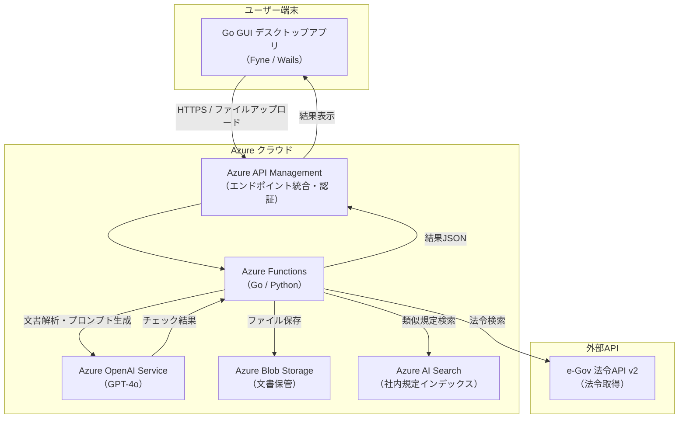
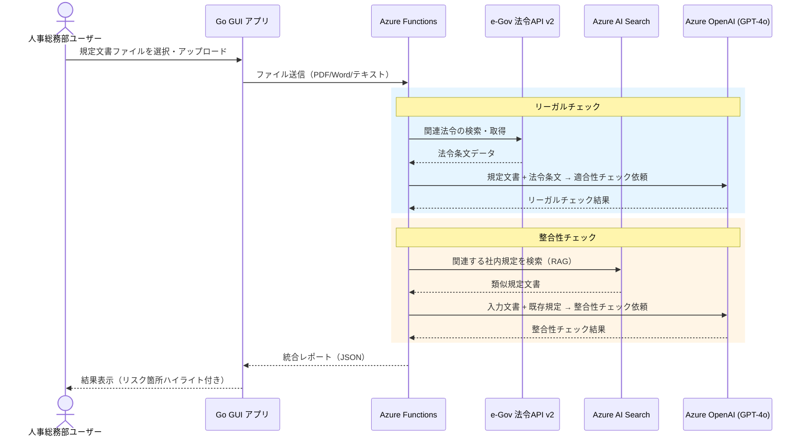
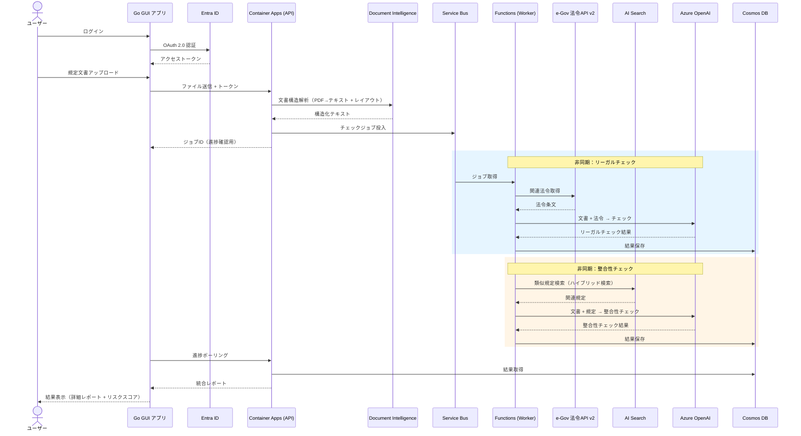
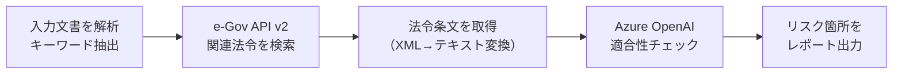
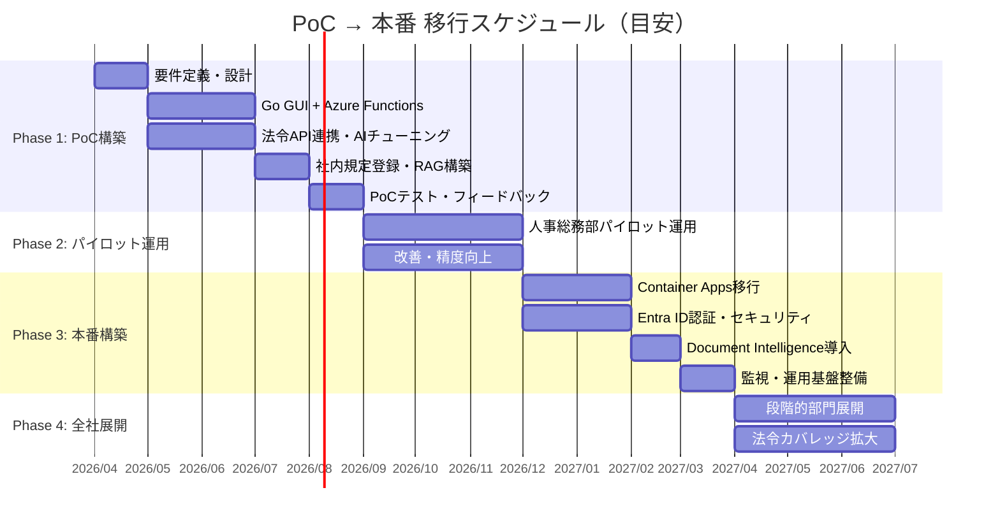

# 規定チェックシステム アーキテクチャ設計書

## 1. システム概要

社内規定文書をGUIツールから入力し、**リーガルチェック（法令適合性）** と **他規定との整合性チェック** をAzureサービス群で自動実行するシステム。

### 対象ユーザー

| フェーズ | 対象 |
|---------|------|
| PoC（パイロット版） | 人事総務部 |
| 本番 | 全社法務・総務・各部門 |

### 2つのチェック機能

| チェック種別 | 内容 | 主な外部連携 |
|-------------|------|-------------|
| リーガルチェック | 入力文書が最新の法令に適合しているか検証 | e-Gov 法令API v2 |
| 整合性チェック | 入力文書が既存の社内規定と矛盾していないか検証 | 社内規定DB（Azure上） |

---

## 2. PoC（パイロット版）アーキテクチャ

> **設計方針**: 人事総務部が迷わず使える最小構成。構築期間を短縮し、コア機能の有効性を早期検証する。

### 2.1 構成図



### 2.2 処理フロー



### 2.3 PoC 技術スタック

| レイヤー | 技術 | 選定理由 |
|---------|------|---------|
| GUI | **Go + Fyne** or **Go + Wails** | Go単体で完結。WailsはモダンなウェブベースUI |
| API基盤 | **Azure Functions**（Consumption） | サーバーレスで低コスト。PoC期間中の課金を抑制 |
| AI | **Azure OpenAI Service**（GPT-4o） | 高精度な文書理解・法令チェック |
| 文書検索 | **Azure AI Search** | 既存規定のベクトル検索（RAG）に最適 |
| ストレージ | **Azure Blob Storage** | アップロード文書・規定原本の保管 |
| 法令取得 | **e-Gov 法令API v2** | 総務省公式。法令の最新版を無料で取得可能 |
| 認証 | **Azure API Management**（Basic） | APIキーベースの簡易認証 |

### 2.4 PoC でのスコープ

```
✅ 含める
  ├── Go GUIからのファイルアップロード（PDF, Word, テキスト）
  ├── リーガルチェック（労働基準法・労働契約法など人事関連法令）
  ├── 整合性チェック（就業規則・賃金規程など主要5規定）
  ├── チェック結果のレポート表示
  └── 結果のPDF/CSV出力

❌ 含めない（本番で対応）
  ├── 全社規定の網羅的登録
  ├── マルチテナント対応
  ├── 承認ワークフロー
  ├── 監査ログの長期保存
  └── Active Directory連携
```

---

## 3. 本番アーキテクチャ

> **設計方針**: エンタープライズグレードのセキュリティ・可用性・拡張性を確保。全社展開を見据えた堅牢な構成。

### 3.1 構成図

```mermaid
flowchart TB
    subgraph ユーザー端末
        GUI["Go GUI デスクトップアプリ<br/>（Wails + WebView）"]
    end

    subgraph Azure["Azure クラウド"]
        direction TB

        subgraph フロント層
            APIM["Azure API Management<br/>（Standard v2）"]
            FD["Azure Front Door<br/>（WAF + CDN）"]
        end

        subgraph 認証・セキュリティ
            AAD["Microsoft Entra ID<br/>（旧 Azure AD）"]
            KV["Azure Key Vault<br/>（シークレット管理）"]
        end

        subgraph アプリケーション層
            ACA["Azure Container Apps<br/>（メインAPI / Go）"]
            FUNC["Azure Functions<br/>（非同期バッチ処理）"]
            SB["Azure Service Bus<br/>（メッセージキュー）"]
        end

        subgraph AI・分析層
            AOAI["Azure OpenAI Service<br/>（GPT-4o / Embedding）"]
            DI["Azure AI Document Intelligence<br/>（文書構造解析）"]
            SEARCH["Azure AI Search<br/>（ベクトル検索 + セマンティック）"]
        end

        subgraph データ層
            BLOB["Azure Blob Storage<br/>（文書保管）"]
            COSMOS["Azure Cosmos DB<br/>（チェック結果・メタデータ）"]
            SQL["Azure SQL Database<br/>（規定マスタ・ユーザー管理）"]
        end

        subgraph 運用・監視
            MON["Azure Monitor<br/>（ログ・メトリクス）"]
            AI_INSIGHTS["Application Insights<br/>（APM）"]
        end
    end

    subgraph 外部API
        EGOV["e-Gov 法令API v2"]
    end

    GUI -- "HTTPS + OAuth 2.0" --> FD
    FD --> APIM
    APIM -- "トークン検証" --> AAD
    APIM --> ACA

    ACA -- "文書解析" --> DI
    ACA -- "同期チェック" --> AOAI
    ACA -- "非同期ジョブ投入" --> SB
    SB --> FUNC
    FUNC --> AOAI
    FUNC --> EGOV
    ACA -- "規定検索（RAG）" --> SEARCH
    ACA --> BLOB
    ACA --> COSMOS
    ACA --> SQL
    ACA -- "シークレット取得" --> KV

    SEARCH -- "インデックス元" --> BLOB

    ACA --> AI_INSIGHTS
    FUNC --> AI_INSIGHTS
    AI_INSIGHTS --> MON
```

### 3.2 処理フロー（本番）



### 3.3 本番 技術スタック

| レイヤー | 技術 | 選定理由 |
|---------|------|---------|
| GUI | **Go + Wails v2** | WebViewベースでリッチUI。React/Vueでフロント構築可能 |
| API Gateway | **Azure Front Door + API Management** | WAF・DDoS防御・レート制限 |
| 認証 | **Microsoft Entra ID** | 社内ADとSSO連携。RBAC対応 |
| メインAPI | **Azure Container Apps**（Go） | コンテナベース。オートスケール対応 |
| 非同期処理 | **Azure Functions + Service Bus** | 大容量文書の非同期チェック。リトライ機構内蔵 |
| 文書解析 | **Azure AI Document Intelligence** | PDF/Word/画像の高精度構造解析 |
| AI | **Azure OpenAI Service**（GPT-4o） | プロンプトエンジニアリングで法令・規定チェック |
| ベクトル検索 | **Azure AI Search**（ハイブリッド） | キーワード + ベクトルの統合検索。RAGに最適 |
| ファイル保管 | **Azure Blob Storage**（GRS） | 地理冗長。ライフサイクル管理 |
| メタデータDB | **Azure Cosmos DB** | 柔軟なスキーマ。グローバル分散対応 |
| マスタDB | **Azure SQL Database** | 規定マスタ・ユーザー管理。トランザクション保証 |
| シークレット | **Azure Key Vault** | APIキー・接続文字列の安全管理 |
| 監視 | **Application Insights + Azure Monitor** | E2Eトレース・アラート |
| 法令取得 | **e-Gov 法令API v2** | 最新法令の自動取得 |

---

## 4. e-Gov 法令API v2 連携詳細

### 4.1 APIエンドポイント

```
ベースURL: https://laws.e-gov.go.jp/api/2/
```

| 用途 | エンドポイント | 説明 |
|------|--------------|------|
| 法令一覧取得 | `GET /lawlists/{category}` | カテゴリ別の法令一覧 |
| 法令データ取得 | `GET /lawdata/{lawId}` | 特定法令の全文取得 |
| キーワード検索 | `GET /keyword` | 法令名・条文のキーワード検索 |

### 4.2 リーガルチェックの流れ



### 4.3 チェック対象法令例（人事総務部向けPoC）

| 法令名 | 主な確認観点 |
|--------|------------|
| 労働基準法 | 労働時間・休日・賃金・解雇規定 |
| 労働契約法 | 就業規則の変更要件・雇止め |
| 労働安全衛生法 | 安全配慮義務・健康診断 |
| パートタイム・有期雇用労働法 | 均等・均衡待遇 |
| 育児介護休業法 | 育休・介護休業の要件 |
| 男女雇用機会均等法 | ハラスメント防止措置 |

---

## 5. Go GUI アプリ設計

### 5.1 画面構成（PoC）

```
┌──────────────────────────────────────────────────┐
│  規定チェックツール              [最小化][閉じる] │
├──────────────────────────────────────────────────┤
│                                                  │
│  📄 チェックする文書を選択してください            │
│  ┌──────────────────────────────┐                │
│  │                              │  [ファイル選択] │
│  │  ここにドラッグ＆ドロップ      │                │
│  │  （PDF / Word / テキスト）    │                │
│  └──────────────────────────────┘                │
│                                                  │
│  チェック種別:                                    │
│  ☑ リーガルチェック（法令適合性）                  │
│  ☑ 整合性チェック（社内規定との比較）              │
│                                                  │
│  対象法令カテゴリ:                                │
│  ☑ 労働基準法  ☑ 労働契約法  ☐ 会社法           │
│                                                  │
│           [ チェック実行 ]                        │
│                                                  │
├──────────────────────────────────────────────────┤
│  📊 チェック結果                                  │
│  ┌──────────────────────────────────────────┐    │
│  │ ⚠ リーガルチェック: 3件の要確認事項        │    │
│  │  ├ 第12条: 時間外労働の上限規定が未記載    │    │
│  │  ├ 第15条: 解雇予告の日数が法定未満       │    │
│  │  └ 第20条: 年次有給休暇の付与日数に誤り   │    │
│  │                                          │    │
│  │ ✅ 整合性チェック: 問題なし               │    │
│  │  ├ 就業規則: 整合                         │    │
│  │  ├ 賃金規程: 整合                         │    │
│  │  └ 旅費規程: 整合                         │    │
│  └──────────────────────────────────────────┘    │
│                                                  │
│  [ レポート出力(PDF) ]  [ レポート出力(CSV) ]     │
└──────────────────────────────────────────────────┘
```

### 5.2 技術選定比較

| フレームワーク | UI | バイナリサイズ | 学習コスト | おすすめ度 |
|--------------|-----|-------------|-----------|-----------|
| **Wails v2** | HTML/CSS/JS（React/Vue） | ~10MB | 中 | ★★★★★ |
| **Fyne** | Go ネイティブウィジェット | ~15MB | 低 | ★★★★☆ |
| **Gio** | Go ネイティブ描画 | ~8MB | 高 | ★★★☆☆ |

**推奨: Wails v2** — モダンなUIが構築でき、人事総務部ユーザーにとって直感的な操作感を提供可能。

---

## 6. PoC → 本番 移行ロードマップ



---

## 7. コスト概算

### PoC 月額概算（Consumption プラン中心）

| サービス | SKU | 月額目安 |
|---------|-----|---------|
| Azure Functions | Consumption | ~¥1,000 |
| Azure OpenAI（GPT-4o） | 従量課金 | ~¥15,000 |
| Azure AI Search | Basic | ~¥12,000 |
| Azure Blob Storage | LRS / Hot | ~¥500 |
| Azure API Management | Consumption | ~¥5,000 |
| **合計** | | **~¥33,500/月** |

### 本番 月額概算

| サービス | SKU | 月額目安 |
|---------|-----|---------|
| Azure Container Apps | 2vCPU / 4GB × 2 | ~¥15,000 |
| Azure Functions | Premium EP1 | ~¥20,000 |
| Azure OpenAI（GPT-4o） | PTU or 従量 | ~¥50,000 |
| Azure AI Search | Standard S1 | ~¥35,000 |
| Azure AI Document Intelligence | S0 | ~¥15,000 |
| Azure Cosmos DB | 400 RU/s | ~¥5,000 |
| Azure SQL Database | Basic | ~¥1,000 |
| Azure Blob Storage | GRS / Hot | ~¥2,000 |
| Azure Front Door + APIM | Standard | ~¥25,000 |
| Azure Key Vault | Standard | ~¥500 |
| Azure Monitor + App Insights | 従量 | ~¥3,000 |
| **合計** | | **~¥171,500/月** |

> ※ 利用量により大きく変動します。上記は中規模利用時の目安です。

---

## 8. セキュリティ要件

| 要件 | PoC | 本番 |
|------|-----|------|
| 認証 | APIキー | Entra ID (OAuth 2.0 / OIDC) |
| 通信暗号化 | TLS 1.2+ | TLS 1.3 |
| データ暗号化 | Azure既定 | CMK (カスタマーマネージドキー) |
| ネットワーク | パブリック | VNet統合 + Private Endpoint |
| 監査ログ | 簡易ログ | Azure Monitor + 長期保存 |
| WAF | なし | Azure Front Door WAF |
| シークレット管理 | 環境変数 | Azure Key Vault |

---

## 9. まとめ

| 観点 | PoC版 | 本番版 |
|------|-------|-------|
| 構成 | サーバーレス中心の最小構成 | コンテナ + サーバーレスのハイブリッド |
| 対象 | 人事総務部（~20名） | 全社（~数百名） |
| 処理 | 同期（リアルタイム応答） | 非同期（Service Bus経由） |
| 認証 | APIキー | Entra ID + RBAC |
| 文書解析 | テキスト直接処理 | Document Intelligence構造解析 |
| 月額 | ~¥33,500 | ~¥171,500 |
| 構築期間 | ~3ヶ月 | ~6ヶ月（PoC後） |
