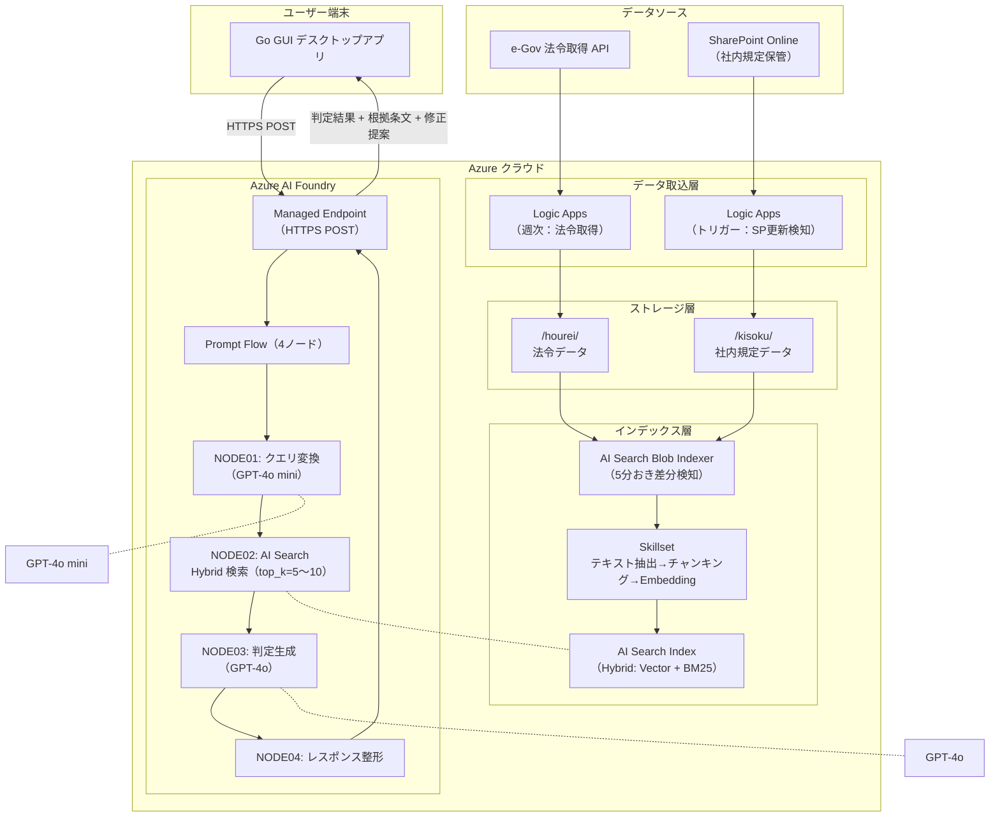
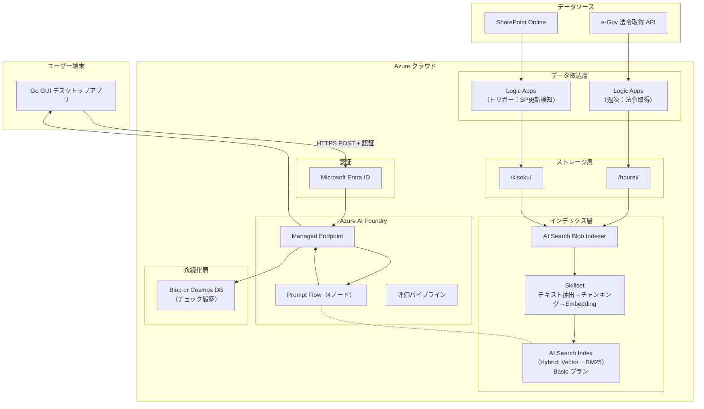
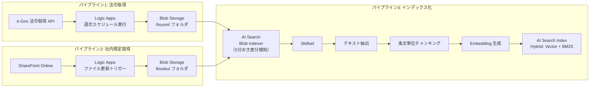
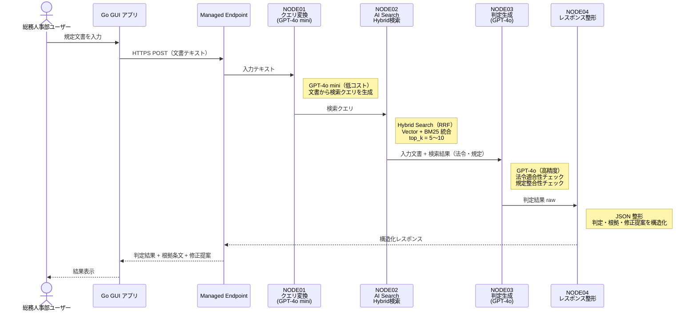
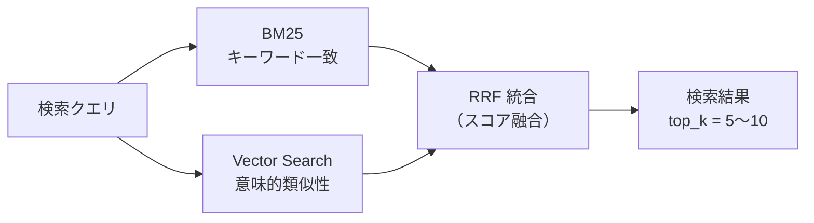
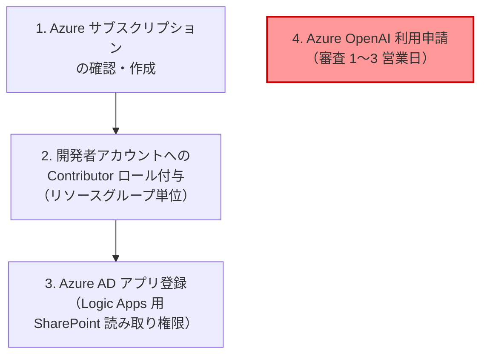
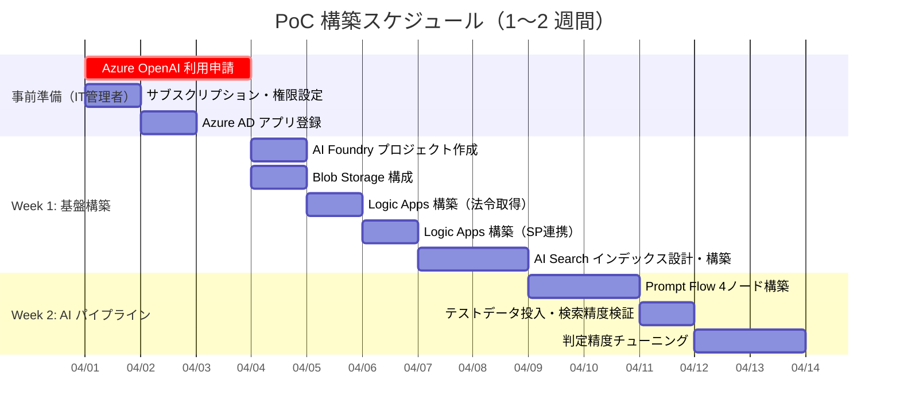
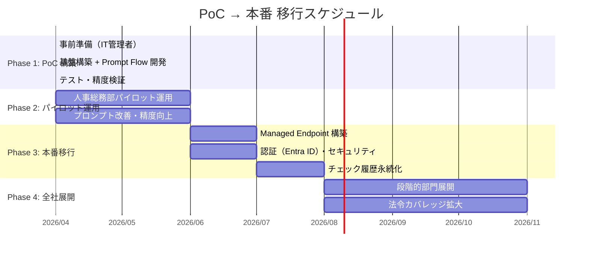

# 規定チェックシステム 確定設計書

> **本書のステータス**: 設計検討の結論をまとめた**確定版**。  
> 3案の比較検討を経て **Plan 03（Azure AI Foundry + Prompt Flow 構成）** を採用。  
> 参考: [Functions版アーキテクチャ](./規定チェックシステム_アーキテクチャ設計書.md) / [AI Foundry版アーキテクチャ](./規定チェックシステム_AI_Foundry版アーキテクチャ.md)

---

## 1. プロジェクト概要

### 1.1 目的

総務人事部の規定文書が、**法令**や**他の社内規定**に照らして適合しているかを AI で自動チェックするシステムを構築する。

### 1.2 制約・方針

| 項目 | 内容 |
|------|------|
| フロントエンド | Go 製 GUI ツール（既存） |
| バックエンド | Microsoft Azure |
| RAG 素材（法令） | e-Gov 法令取得 API v2 |
| RAG 素材（社内規定） | SharePoint Online に保管されている社内規定 |
| 基本方針 | **低コスト・シンプル・高精度** |

### 1.3 Plan 03 を選定した理由

3案を比較検討し、以下の理由で **AI Foundry + Prompt Flow 構成** を採用した。

| 理由 | 詳細 |
|------|------|
| AI Foundry ハブ自体が無料 | プロジェクト作成に追加課金なし |
| Prompt Flow の GUI 管理 | プロンプト改善サイクルが速い |
| Foundry の評価機能 | RAG 精度を定量測定できる |
| モデル使い分け | 単純クエリは GPT-4o-mini でコスト削減 |

### 1.4 Azure Functions について

> **今回の構成では Azure Functions は不要。**

| 役割 | 担当サービス |
|------|-------------|
| リクエスト受付 | Managed Endpoint（Prompt Flow デプロイ先） |
| スケジューラ・SharePoint 連携 | Logic Apps |
| 自動インデックス化 | AI Search Blob インデクサー |

唯一 Functions が必要になるケース: Logic Apps で処理できない複雑なデータ変換が生じた場合のみ。

---

## 2. 使用サービス一覧

| サービス | 役割 | PoC 月額 |
|---------|------|---------|
| Azure AI Foundry | AI 開発統合プラットフォーム（ハブ） | 無料 |
| Azure AI Search | Hybrid 検索インデックス（Vector + BM25） | 無料（Free プラン） |
| Azure Blob Storage | ファイル中間保管庫 | ~¥100 |
| Azure OpenAI（GPT-4o / mini） | 判定生成 AI エンジン | ~¥500〜1,000 |
| Azure Logic Apps | データ取込自動化ワークフロー | ~¥200〜500 |
| Prompt Flow | AI 処理パイプライン（4 ノード） | 無料（Foundry 内） |

### コスト概算

| フェーズ | 月額 | 備考 |
|---------|------|------|
| **PoC** | **¥1,000〜2,000** | Free プラン・従量課金中心 |
| **本番** | **¥6,000〜10,000** | AI Search Basic 移行 + Managed Endpoint 追加 |

---

## 3. アーキテクチャ全体像

### 3.1 PoC 構成図



### 3.2 本番 構成図



---

## 4. データフロー詳細

### 4.1 データ取込（自動化）

3つのパイプラインで法令・社内規定を自動的に AI Search インデックスへ反映する。



### 4.2 SharePoint 連携方式

> **SharePoint 直結インデクサーは使わない。**

| 方式 | 状態 | 採用 |
|------|------|------|
| AI Search SharePoint インデクサー | プレビュー版（本番非推奨と Microsoft 公式が明記） | **不採用** |
| Logic Apps SharePoint コネクタ | **GA（一般提供）済み** | **採用** |

**Logic Apps の仕組み:**
- SharePoint コネクタが標準搭載（Graph API の直接実装不要）
- SharePoint のファイル更新をトリガーにして自動で Blob にコピー
- Azure AD アプリ登録が事前に 1 件必要（IT 管理者依頼、30〜60分）

### 4.3 PDF の OCR 対応

| 項目 | 状態 |
|------|------|
| 対象ファイル形式 | テキスト PDF（デジタル作成） |
| OCR | **不要** |
| テキスト抽出 | AI Search の Blob インデクサーが標準で実行 |
| 対応形式 | Word / Excel / PowerPoint / JSON / XML も混在対応（自動判別） |
| 注意事項 | パスワードロック付き PDF はインデクサーがスキップする |

### 4.4 クエリ処理フロー



---

## 5. Prompt Flow 4ノード設計

### 5.1 ノード一覧

| ノード | 種別 | モデル | 役割 | コスト特性 |
|-------|------|--------|------|-----------|
| NODE01 | LLM | **GPT-4o mini** | クエリ変換（入力文書→検索用クエリ） | 低コスト |
| NODE02 | Tool | — | AI Search Hybrid 検索（top_k=5〜10） | AI Search 課金のみ |
| NODE03 | LLM | **GPT-4o** | 判定生成（法令適合性・規定整合性チェック） | 精度重視 |
| NODE04 | Python | — | レスポンス整形（JSON 構造化） | 無料 |

### 5.2 NODE01: クエリ変換

```
入力: 規定文書のテキスト全文
処理: GPT-4o mini で文書の要点を抽出し、AI Search 用の検索クエリに変換
出力: 検索クエリ文字列（複数キーワード・条文番号等）
```

GPT-4o mini を使う理由: クエリ変換は比較的単純なタスクであり、高精度モデルは不要。コスト削減に寄与。

### 5.3 NODE02: AI Search Hybrid 検索

```
入力: NODE01 で生成した検索クエリ
処理: AI Search に Hybrid Search（RRF）を実行
       - BM25（キーワード一致）+ Vector（意味的類似性）を統合
       - top_k = 5〜10 件を取得
出力: 関連する法令条文 + 社内規定のチャンク群
```

### 5.4 NODE03: 判定生成

```
入力: 元の規定文書 + NODE02 の検索結果（法令・規定チャンク）
処理: GPT-4o で以下を判定
       - 法令適合性: 法令に違反・不整合な箇所の指摘
       - 規定整合性: 他の社内規定と矛盾する箇所の指摘
       - 各指摘に対する根拠条文の引用
       - 修正提案の生成
出力: 判定結果（raw テキスト）
```

GPT-4o を使う理由: 法令チェックは高い精度が求められるタスク。ハルシネーション抑制のため最高精度モデルを使用。

### 5.5 NODE04: レスポンス整形

```
入力: NODE03 の判定結果 raw テキスト
処理: Python でJSON 構造に整形
出力:
{
  "legal_check": {
    "status": "warning",
    "issues": [
      {
        "article": "第12条",
        "issue": "時間外労働の上限規定が未記載",
        "law_reference": "労働基準法第36条",
        "suggestion": "36協定に基づく上限時間の明記を推奨"
      }
    ]
  },
  "consistency_check": {
    "status": "ok",
    "comparisons": [...]
  }
}
```

---

## 6. インデックス設計

### 6.1 チャンキング方針

> **条文・条番号単位** でチャンキングを行う（段落単位では精度が落ちる）。

| 方式 | 精度 | 採用 |
|------|------|------|
| 固定長チャンキング（512 tokens 等） | 低（条文が分断される） | 不採用 |
| 段落単位チャンキング | 中（意味の境界が曖昧） | 不採用 |
| **条文・条番号単位チャンキング** | **高**（法的意味の境界が明確） | **採用** |

### 6.2 インデックスフィールド

| フィールド名 | 型 | 説明 | 必須 |
|-------------|-----|------|------|
| `content` | string | 条文テキスト本文 | Yes |
| `content_vector` | vector | Embedding ベクトル | Yes |
| `source` | string | `hourei` or `kisoku` | Yes |
| `law_name` | string | 法令名 / 規定名 | Yes |
| `article_no` | string | 条番号（例: "第36条"） | Yes |
| `effective_date` | date | 施行日 / 制定日 | Yes |
| `doc_title` | string | 文書タイトル | Yes |

### 6.3 検索方式

**Hybrid Search（RRF: Reciprocal Rank Fusion）** を ON にする。



BM25 とベクトル検索を統合することで、キーワード完全一致（法令名・条番号）と意味的類似性の両方をカバーし、精度が大幅に向上する。

---

## 7. PoC と本番の差分

| 項目 | PoC | 本番 |
|------|-----|------|
| データ取込 | Logic Apps 自動化 | 同左 |
| Go GUI 接続 | Foundry テスト画面で代替可 | Managed Endpoint 接続 |
| AI Search プラン | **Free**（50MB） | **Basic**（~¥1,400/月） |
| チェック履歴 | なし | Blob or Cosmos DB に永続化 |
| 認証・RBAC | 最小限 | 本番セキュリティ設計 |
| 構築期間 | **1〜2 週間** | 追加 2〜4 週間 |

---

## 8. PoC 検証項目

### 8.1 検証する 4 つのポイント

| # | 検証項目 | 説明 |
|---|---------|------|
| 1 | **Recall（検索ヒット率）** | 関連条文が正しく検索にヒットするか |
| 2 | **引用正確性** | 判定根拠が正確に引用されているか |
| 3 | **ハルシネーション率** | でたらめな条文引用が許容範囲内か |
| 4 | **チャンク品質** | チャンク粒度が条文単位で正しく分割されているか |

### 8.2 本番化判断の目安

| メトリクス | 目標値 |
|-----------|-------|
| 正解率（判定の正確性） | **80% 以上** |
| 根拠条文の引用ミス率 | **5% 以下** |
| 1 クエリあたり応答時間 | **10 秒以内** |

---

## 9. PoC 開始前に必要な作業

### 9.1 IT 管理者への依頼（先決事項）



> **最も重要: Azure OpenAI 利用申請は審査に 1〜3 営業日かかるため、最初に着手すること。**

| # | 作業 | 担当 | 所要時間 |
|---|------|------|---------|
| 1 | Azure サブスクリプション確認・作成 | IT 管理者 | 30 分 |
| 2 | 開発者へ Contributor ロール付与 | IT 管理者 | 15 分 |
| 3 | Azure AD アプリ登録（SharePoint 読取権限） | IT 管理者 | 30〜60 分 |
| 4 | **Azure OpenAI 利用申請** | IT 管理者 or 開発者 | **1〜3 営業日（審査）** |

### 9.2 開発者が準備するもの

| 準備物 | 数量 | 用途 |
|--------|------|------|
| 検証用社内規定ファイル | 20〜50 件 | インデックス登録・検索テスト |
| 対応する法令データのリスト | — | 法令取得 API からの取込対象 |
| テストケース（入力と期待判定） | 10〜20 件 | PoC 精度検証 |

---

## 10. Azure 契約について

### 10.1 基本事項

- **サービス単位の個別契約は不要**。サブスクリプション 1 つで全サービスが使える
- 既存の Microsoft 365 テナント（会社ドメイン）に Azure サブスクリプションを紐付けて利用
- 開発者は会社の Entra ID アカウント（`名前@会社.com`）で Azure ポータルにサインイン

### 10.2 権限管理

```
Azure サブスクリプション
  └── リソースグループ（PoC用）
       ├── 開発者 → 「共同作成者（Contributor）」ロール
       └── IT管理者 → 「所有者（Owner）」ロール
```

### 10.3 課金

| フェーズ | 課金方式 |
|---------|---------|
| PoC | **従量課金（Pay-As-You-Go）** で開始 |
| 本番化時 | 年間契約（Reserved Instance 等）へ移行検討 |

---

## 11. AI Foundry vs Copilot Studio の整理

| 観点 | Copilot Studio | Azure AI Foundry |
|------|---------------|-----------------|
| 対象ユーザー | ビジネス担当者 | 開発者 |
| カスタマイズ性 | 低い | **高い（今回採用）** |
| SharePoint 連携 | 標準搭載 | Logic Apps 経由で実装 |
| RAG 精度制御 | ほぼ不可 | **完全制御可能** |
| チャンキング制御 | 不可 | **条文単位で制御可能** |
| モデル使い分け | 不可 | **ノード単位で使い分け可能** |
| 向いている用途 | 社内 FAQ チャットボット | **業務特化の判定システム** |

> 今回は「条文単位チャンキング」「モデル使い分け（GPT-4o / mini）」「判定根拠の正確な引用」が必要なため **AI Foundry を選択**。

---

## 12. PoC 構築スケジュール



---

## 13. 本番化ロードマップ



---

## 14. 出力済みの成果物一覧

これまでの検討過程で作成された成果物。

| # | 成果物 | 内容 |
|---|--------|------|
| 1 | アーキテクチャ提案書（3案） | Plan01〜03 の比較検討 |
| 2 | 全体フロー図 | 4 フェーズの詳細フロー |
| 3 | PoC 構成資料 | 本番との差分・2 週間スケジュール |
| 4 | PoC 解説資料 | 非技術者向けサービス説明・コスト詳細・Q&A |
| 5 | 設計図 3 点セット | フローチャート・シーケンス図・アーキテクチャ図 |
| 6 | [Functions 版アーキテクチャ](./規定チェックシステム_アーキテクチャ設計書.md) | Functions 中心の設計案（本リポジトリ） |
| 7 | [AI Foundry 版アーキテクチャ](./規定チェックシステム_AI_Foundry版アーキテクチャ.md) | AI Foundry 中心の設計案（本リポジトリ） |
| 8 | **本書（確定設計書）** | 検討結果を統合した確定版 |

---

## 15. まとめ

| 観点 | PoC | 本番 |
|------|-----|------|
| アーキテクチャ | AI Foundry + Prompt Flow（4 ノード） | 同左 + Managed Endpoint |
| データ取込 | Logic Apps（法令 API 週次 + SP 更新トリガー） | 同左 |
| インデックス | AI Search Free（50MB）/ Hybrid Search | AI Search Basic |
| AI モデル | GPT-4o mini（NODE01） + GPT-4o（NODE03） | 同左 |
| GUI 接続 | Foundry テスト画面 or 直接接続 | Managed Endpoint（HTTPS） |
| 履歴保存 | なし | Blob or Cosmos DB |
| 認証 | 最小限 | Entra ID + RBAC |
| 月額コスト | **¥1,000〜2,000** | **¥6,000〜10,000** |
| 構築期間 | **1〜2 週間** | 追加 2〜4 週間 |
| 本番化判断基準 | 正解率 80%+ / 引用ミス 5%以下 / 応答 10 秒以内 | — |
